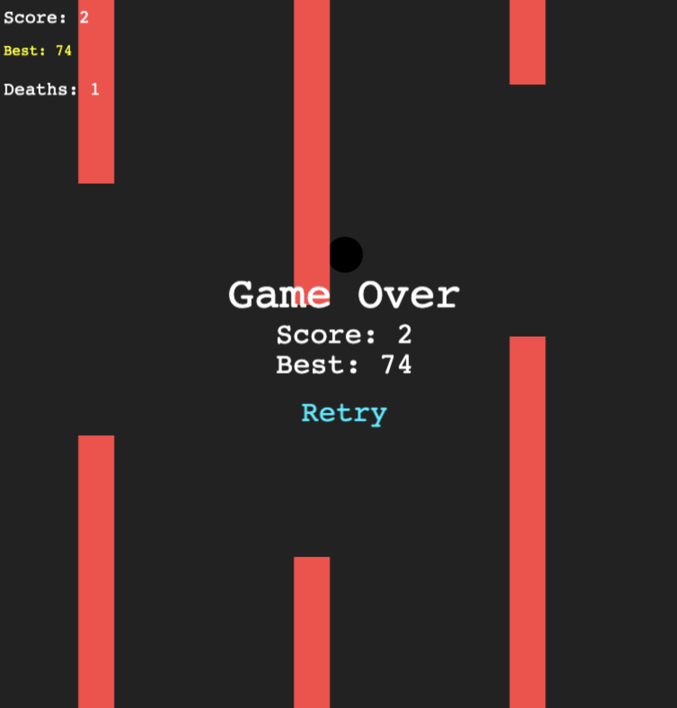

# Flap and Spin

A fast-paced, addictive flappy bird-style game built with Phaser 3, featuring dynamic difficulty, camera effects, and smooth physics.



## 🎮 How to Play

Navigate a bouncing ball through moving walls with gaps. Click or press SPACE to make the ball bounce upward against gravity. Avoid hitting the walls or going off-screen!

- **Objective**: Survive as long as possible and achieve the highest score
- **Controls**: Click anywhere or press SPACEBAR to bounce
- **Scoring**: Pass through wall gaps to increase your score

## ✨ Features

- **Progressive Difficulty**: Wall speed increases every 10 points, gaps get smaller
- **Dynamic Camera Effects**: Camera rotates as your score increases for added challenge
- **Color-Changing Walls**: Walls cycle through different colors during gameplay
- **Persistent Stats**: Best score and death count saved locally
- **Responsive Design**: Adapts to different screen sizes
- **Smooth Physics**: Realistic gravity and bounce mechanics

## 🚀 Getting Started

### Prerequisites
- Node.js (v16 or higher)
- npm or yarn

### Installation

1. Clone the repository:
```sh
git clone https://github.com/domi7777/flap-and-spin.git
cd flap-and-spin
```

2. Install dependencies:
```sh
npm install
```

3. Start the development server:
```sh
npm run dev
```

4. Open your browser to `http://localhost:5173` and start playing!

## 🛠️ Development

### Project Structure
```
src/
├── main.ts          # Main game logic and scene
├── CameraManager.ts # Camera rotation effects
├── style.css        # Game styling
└── vite-env.d.ts    # Vite type definitions

public/              # Static assets
index.html          # Main HTML file
```

### Available Scripts

- `npm run dev` - Start development server with hot reload
- `npm run build` - Build for production
- `npm run preview` - Preview production build locally

### Game Mechanics

The game features several key systems:

- **Physics**: Arcade physics with gravity and collision detection
- **Wall Generation**: Procedurally generated walls with random gap positions
- **Difficulty Scaling**: Automatic speed and gap adjustments based on score
- **Camera System**: Dynamic camera rotation synchronized with score progression
- **State Management**: Game over, restart, and persistent statistics

## 🎯 Game Configuration

Key constants can be adjusted in `src/main.ts`:

- `WALL_SPEED`: Base wall movement speed (200)
- `GRAVITY`: Downward force on the ball (800)
- `BOUNCE_VELOCITY`: Upward velocity when bouncing (-350)
- `WALL_GAP`: Initial gap size between walls (280)
- `WALL_INTERVAL`: Time between wall spawns (1200ms)

## 📊 Statistics

- **Score**: Current game score (resets on death)
- **Best Score**: Personal high score (persisted in firebase)
- **Deaths**: Total number of game overs (persisted in firebase)

## 🏗️ Build & Deploy

### Production Build
```sh
npm run build
```

The built files will be in the `dist/` directory, ready for deployment to any static hosting service.

### Deployment Options
- **Vercel**: Connect your GitHub repo for automatic deployments
- **Netlify**: Drag & drop the `dist` folder or connect via Git
- **GitHub Pages**: Use GitHub Actions for automated deployment

## 🤝 Contributing

1. Fork the repository
2. Create a feature branch: `git checkout -b feature/amazing-feature`
3. Commit your changes: `git commit -m 'Add amazing feature'`
4. Push to the branch: `git push origin feature/amazing-feature`
5. Open a Pull Request

## 📄 License

This project is licensed under the MIT License - see the [LICENSE](LICENSE) file for details.

## 🙏 Acknowledgments

- Built with [Phaser 3](https://phaser.io/) - A fast, free and fun open source framework for Canvas and WebGL powered browser games
- Powered by [Vite](https://vitejs.dev/) - Next generation frontend tooling
- TypeScript for type safety and better development experience
